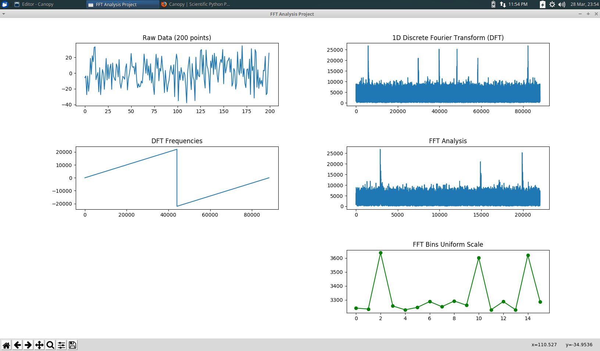

# Fast-Fourier-Transform-Testing

My goal is really to utilize FFT on IoT devices, real time, with minimal latency, most
likely Raspberry Pi or Orange Pi.  The Orange Pi Zero has a very easy to use analog
microphone. I realized that python makes a pretty good scientific prototyping language
to get my head in the game, and get a basic understanding of what is going on here...  

Ultimately I will probably move to C/C++ implementations for low latency functioning,
but for now this python stuff works.  Until this project I had just a cursory
experience with Python. Spent some time studying up on numpy and MatPlotLib for
this exercise.

### Software Tools Used In Project

I needed to get up to speed on NumPy... Watched a pretty decent video from

    [NumPy Beginner | SciPy 2016 Tutorial | Alexandre Chabot LeClerc](https://www.youtube.com/watch?v=gtejJ3RCddE)
        Enthought       Published on Jul 14, 2016  (2.5hrs)
        https://github.com/enthought/Numpy-Tutorial-SciPyConf-2016

I ended up using Enthought's Integrated Development Enviroment tool [Canopy](https://www.enthought.com/product/canopy/)
for this project.  I really like the integrated Jupiter Notebook console. That makes it easy to do quick testing and look up library details.  

I've doing my testing on a Xubuntu Virtualbox on MacOS hardware.  Tried using
PyCharm, but that tool was way too slow to be practical on a virtual machine.  The Canopy IDE ran great.

### Here's a teaser...  FFT Output with 16 Bin Plot...

### References:
https://stackoverflow.com/questions/49268647/creating-an-amplitude-vs-frequency-spectrogram-of-an-audio-file-in-python
(I really like the test signal setup, with visible peak, modulation and white noise)

see also: https://stackoverflow.com/questions/3694918/how-to-extract-frequency-associated-with-fft-values-in-python
(I like the wav file stuff on this posting)

http://nairobi-embedded.org/alsa_daq_and_rt_fft.html
(When we get to the C/C++ stuff, using ALSA, this seems like a pretty decent resource... )

### Project Progression:
 - Create waveform, drive to FFT/frequency plot, and then to FFT/Bin plot. (Python)
 - Create .wav file, perform same analysis. (Python)
 - Record .wave file with microphone, perform same analysis. (Python)
 - convert to C/C++, repeat the above three programs.
 - Finally use microphone to display real time FFT/Bin plots...
